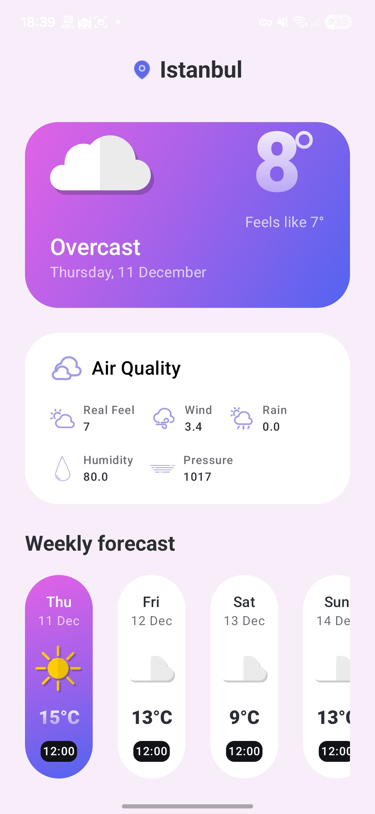

# 📱 WeatherApp  
A modern weather application built with **Kotlin**, **Jetpack Compose**, **Clean Architecture**, and **Hilt Dependency Injection**.  
The app retrieves the user's current location, fetches real-time weather data from an external API, and displays it with a clean and minimal UI.

---

## 🌤 Features

- 🌍 **Current Location Weather** – Automatically fetches user location using a custom `LocationTracker`.
- ☁️ **Real-Time Weather Data** – Retrieves weather information from a remote API.
- 📍 **Reverse Geocoding** – Converts latitude/longitude into a readable city name.
- 🎨 **Jetpack Compose UI** – Fully built with a modern declarative UI approach.
- 🧱 **Clean Architecture** – Clear separation of Presentation, Domain, and Data layers.
- 🔐 **Hilt Dependency Injection** – Scalable and testable dependency structure.
- ⚡ **Coroutines & Flows** – Smooth asynchronous operations.
- 🧪 **Graceful Error Handling** – Handles API, location, and geocoding failures.

---

## 🏗 Tech Stack

| Layer | Technologies |
|------|--------------|
| **UI/Presentation** | Jetpack Compose, ViewModel, State Management |
| **Domain** | Repository Interfaces, UseCases, Weather Models |
| **Data** | Retrofit, DTOs, Mappers, API Implementation |
| **DI** | Hilt |
| **Async** | Kotlin Coroutines, Flow |
| **Location** | Fused Location Provider, Geocoder |

---

## 📸 Screenshots  
<p float="left">
  
</p>
---

## 🔐 Permissions Used
- ACCESS_COARSE_LOCATION
- ACCESS_FINE_LOCATION
- ACCESS_BACKGROUND_LOCATION

---

## 🚀 Getting Started

# Api-Key

Get your api key here "https://open-meteo.com/"

WEATHER_API_KEY=your_api_key_here

## ▶️ How to Run

1️⃣ Clone the repository

```bash
git clone https://github.com/durdyshev/WeatherApp.git

cd WeatherApp
